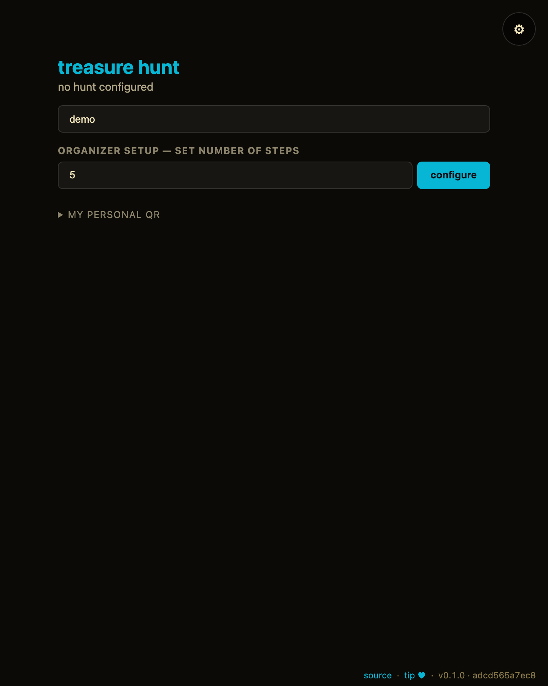

# mesh-treasure-hunt

[](https://baditaflorin.github.io/mesh-treasure-hunt/)
[](https://github.com/baditaflorin/mesh-treasure-hunt/blob/main/package.json)
[](./LICENSE)

> Ordered QR treasure hunt — print N posters, scan them in order to win

**Live → https://baditaflorin.github.io/mesh-treasure-hunt/**

**Source → https://github.com/baditaflorin/mesh-treasure-hunt**

**Tip the dev (buy a coffee) → https://www.paypal.com/paypalme/florinbadita**

**Security audit (programmatic, headless, CPU-only) → [docs/security-audit.md](./docs/security-audit.md)** — re-run with `npm run audit:security`

---



## What it is

A **rootless-computing** peer-to-peer browser app. No backend of its own beyond the self-hosted WebRTC stack listed below. State lives in a Yjs mesh shared by everyone in the same room.

Read the principles → **https://baditaflorin.github.io/rootless-computing/principles.html**

## Quickstart

Open the live URL on two devices in the same room (set in ⚙ settings, or scan the room QR). Everything else is in-app.

For local hacking:

```bash
git clone https://github.com/baditaflorin/mesh-common
git clone https://github.com/baditaflorin/mesh-treasure-hunt
cd mesh-treasure-hunt
npm install
npm run dev
```

`mesh-common` must sit as a **sibling** directory because `package.json` references it via `file:../mesh-common`.

## Self-hosted infrastructure

| Repo                                              | Endpoint                               | Purpose                     |
| ------------------------------------------------- | -------------------------------------- | --------------------------- |
| https://github.com/baditaflorin/signaling-server  | `wss://turn.0docker.com/ws`            | y-webrtc signaling fan-out  |
| https://github.com/baditaflorin/turn-token-server | `https://turn.0docker.com/credentials` | HMAC TURN creds, 1-hour TTL |
| https://github.com/baditaflorin/coturn-hetzner    | `turn:turn.0docker.com:3479`           | TURN relay                  |

## Settings overrides

The settings drawer lets the user override signaling and TURN endpoints. localStorage keys:

- `mesh-treasure-hunt:signalingUrl`
- `mesh-treasure-hunt:turnTokenUrl`
- `mesh-treasure-hunt:iceServers`
- `mesh-treasure-hunt:room`

If endpoints are blank or unreachable, the app falls back to STUN-only.

## Version + commit on every screen

The bottom-right footer on every screen of the live app shows:

- `source` → this repo
- `tip ♥` → PayPal
- `vX.Y.Z · <short-sha>` — version from `package.json` plus the build-time git commit

## Build & deploy

GitHub Pages serves the committed `docs/` directory on the `main` branch. There is no GitHub Actions build workflow; local Husky-style hooks gate formatting / typecheck / smoke build before each push.

```bash
npm run smoke                                    # build + sanity-check docs/
bash ../mesh-common/scripts/screenshot-app.sh    # regenerate docs/screenshot.png
```

## Privacy

See `docs/privacy.md` for the threat model — what other peers in the mesh see, what the self-hosted infra sees, what stays local.

## License

MIT — see `LICENSE`.
